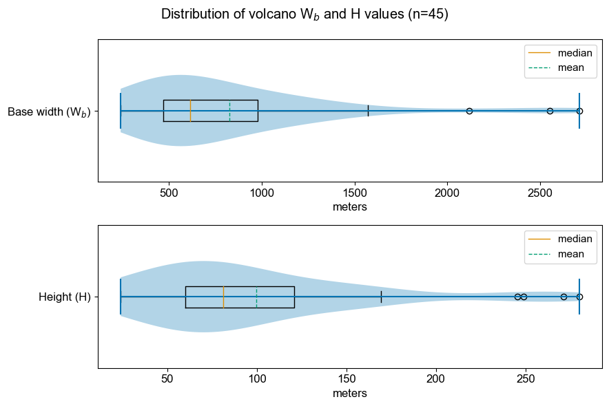
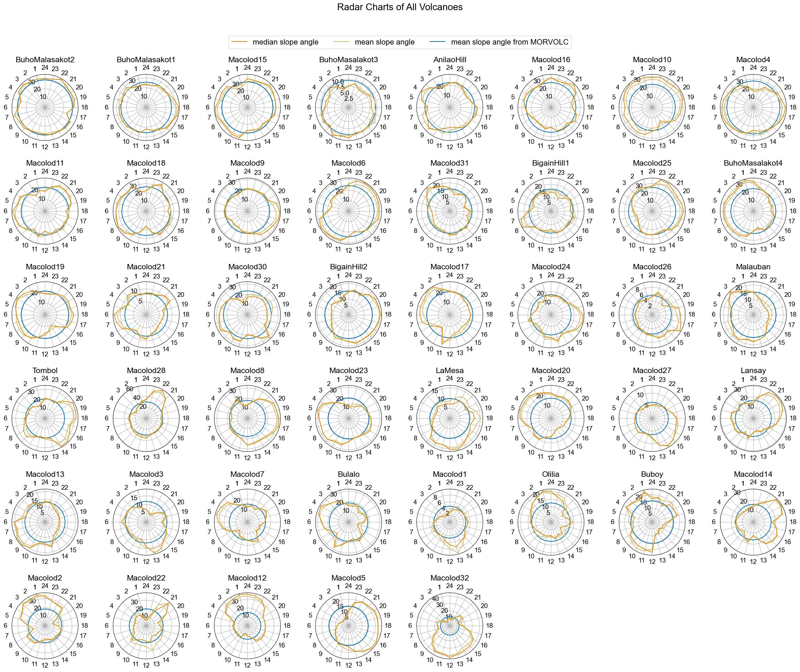
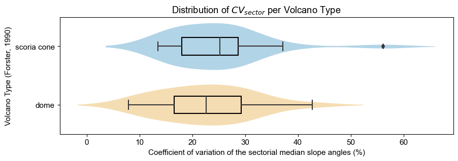
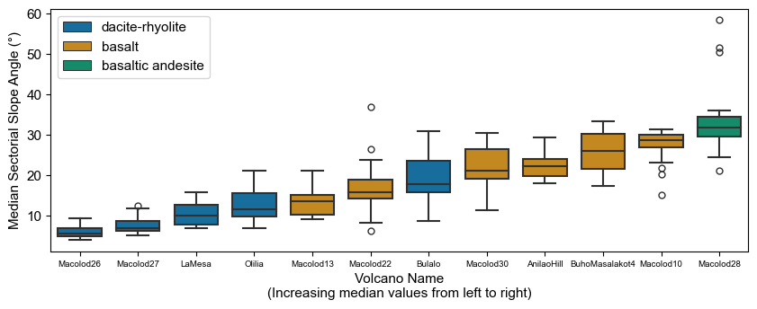
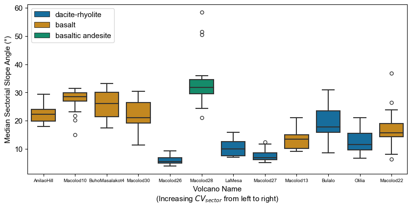
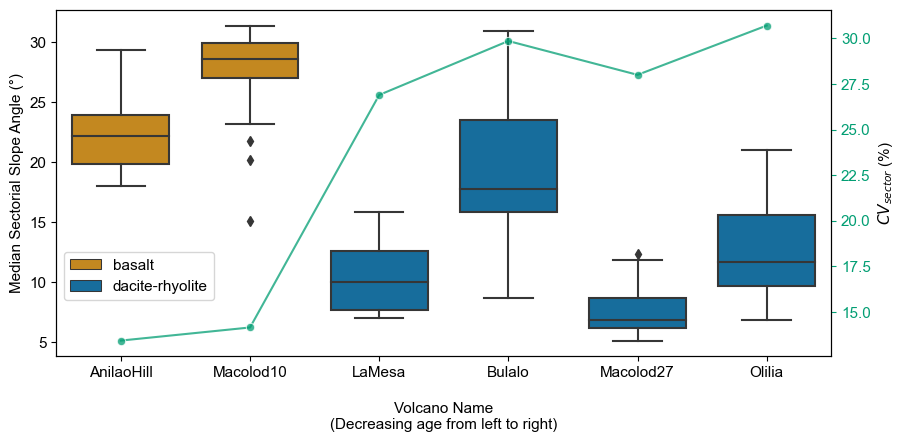

# Undergraduate Thesis - Data Visualization

Repository of map figures (created using QGIS and GeoRose) and Python code used for data analysis and visualization in my undergraduate thesis titled *Morphometric analysis of monogenetic volcanoes in the Macolod Corridor using MORVOLC and the sectorial approach*

***This undergraduate thesis is pending publication.***

## Title
**Morphometric analysis of monogenetic volcanoes in the Macolod Corridor using MORVOLC and the sectorial approach**

## Abstract
<p align=justify>
The Macolod Corridor is a region of active volcanism in Luzon with over 200 volcanic centers. Studying the morphometry of monogenetic volcanoes can provide valuable information on their growth and evolution. The current whole edifice approach does not capture the variability in morphometry, so a sectorial approach was used to evaluate the asymmetry of cones and domes and infer the factors that controlled their asymmetry. The study found that the steeper the volcano, the more symmetrical it tended to be, and the elongations of the volcano base were parallel to NE-SW trending faults in the region. Wind could also influence the asymmetry of volcanoes. It was also found that dacitic-rhyolitic domes tended to be more asymmetrical than basaltic cones. The orientation of the steepest and least steep sectors for volcanoes emplaced on the flanks of polygenetic cones varied significantly and may be influenced by more complex factors.
</p>
<p align=right>
<i>Eugene Toribio<br>
National Institute of Geological Sciences<br>
University of the Philippines Diliman<br>
  March 2023</i>
</p>
<p align=right>
<i>Thesis Adviser:<br>
Alfredo Mahar Francisco A. Lagmay, Ph. D.<br>
National Institute of Geological Sciences<br>
University of the Philippines Diliman</i>
</p>
<p align=right>
<i>Thesis Co-Adviser:<br>
Engielle Mae R. Paguican-Fabbro, Ph. D.<br>
Department of Geography<br>
Vrije Universiteit Brussel</i>
</p>

## Figures
<p align="center"></img></p>
<p>Figure 1. Location map of the Macolod Corridor in southwestern Luzon. Boundaries of the Macolod Corridor were adapted from Förster et al. (1990). Outlines of monogenetic volcanoes are drawn in red.</p><br>
<p align="center"></img></p>
<p>Figure 5. Distribution of basal width (Wb) and height (H) of the 45 characterized monogenetic volcanoes in the Macolod Corridor.</p><br>
<p align="center"></img></p>
<p>Figure 6. Distribution of average slope angles of the whole edifices of the 45 characterized monogenetic volcanoes in the Macolod Corridor.</p><br>
<p align="center"></img></p>
<p>Figure 7. Sectorial values of median slope angles (gold), mean slope angles (light yellow), and whole-edifice average slope (blue) of monogenetic cones and domes in the Macolod Corridor.</p><br>
<p align="center"></img></p>
<p>Figure 8. Distribution of the coefficient of variation of the sectorial median slope angles (CVsector) of characterized monogenetic volcanoes in the Macolod Corridor, grouped according to volcano type.</p><br>
<p align="center"></img></p>
<p>Figure 9. Plots of height-basal width ratio and average slope angle vs. coefficient of variation of the sectorial median slope angles. The orange lines of best fit illustrate the medium negative linear relationship of CVsector with H/Wb and total average slope, respectively.</p><br>
<p align="center"></img></p>
<p>Figure 10. Faults in the Macolod Corridor drawn in white and volcano boundaries drawn in red. Rose diagrams show the preferential alignment of both faults and volcano base elongations along the NE. Also shown are rose diagrams of the azimuth of the sector with maximum or minimum median slope.</p><br>
<p align="center"></img></p>
<p>Figure 11. Boxplots showing the ranges of the median slope angles of the sectors of volcanoes in the Macolod Corridor with available geochemical data, plotted according to increasing median values from left to right.</p><br>
<p align="center"></img></p>
<p>Figure 12. Boxplots showing the ranges of the median slope angles of the sectors of volcanoes in the Macolod Corridor with available geochemical data, plotted according to increasing CVsector i.e., asymmetry, from left to right.</p><br>
<p align="center"></img></p>
<p>Figure 13. Boxplots showing the ranges of the median slope angles of the sectors of the 6 volcanoes with available geochronological data, ordered from left to right according to decreasing age. Geochronological ages are also indicated below the volcano names. The green line plot illustrates the trend of the coefficient of variation of the sectorial median slope angles (CVsector) across the 6 volcanoes.</p><br>
<p align="center"></img></p>
<p>Figure 14. Hillshade images of Banahaw and San Cristobal (A) and Makiling (B). Highlighted in white are the monogenetic volcanoes emplaced on the flanks of these volcanoes. The blue sector is the least steep sector while the red sector is the steepest sector.</p><br>

## Dependencies
```
pip install jupyter
pip install numpy
pip install pandas
pip install matplotlib
pip install seaborn
```
## Support 

Contact me if you would like a copy of my manuscript.
- [toribio.eft@gmail.com](mailto:toribio.eft@gmail.com "toribio.eft@gmail.com")
